## 1. 概况

### SpringCloud 统一配置中心

如果微服务架构中没有使用统一配置中心时，所存在的问题： 

- 配置文件分散在各个项目里，不方便维护 
- 配置内容安全与权限，实际开发中，开发人员是不知道线上环境的配置的 
- 更新配置后，项目需要重启 

>  Spring Cloud Config就是我们通常意义上的配置中心。Spring Cloud Config-把应用原本放在本地文件的配置抽取出来放在中心服务器，本质是配置信息从本地迁移到云端。从而能够提供更好的管理、发布能力。         
>
> Spring Cloud Config分服务端和客户端，服务端负责将git（svn）中存储的配置文件发布成REST接口，客户端可以从服务端REST接口获取配置。 


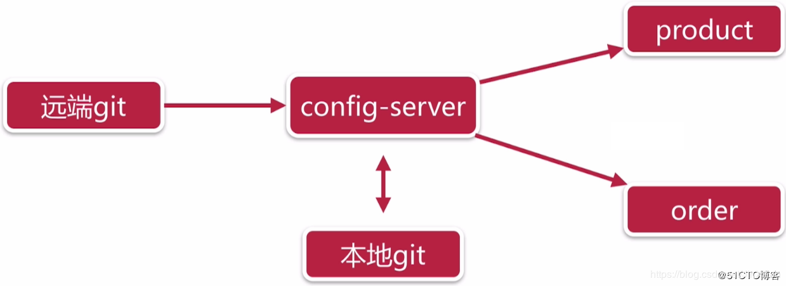

## 2. Config Server

### 版本 

springboot <version>2.2.1.RELEASE</version>

springcloud <spring-cloud.version>Hoxton.RC2</spring-cloud.version>

### 添加依赖

```xml
<dependency>
            <groupId>org.springframework.cloud</groupId>
            <artifactId>spring-cloud-config-server</artifactId>
        </dependency>
        <dependency>
            <groupId>org.springframework.cloud</groupId>
            <artifactId>spring-cloud-starter-netflix-eureka-client</artifactId>
        </dependency>
```


### 在启动类上加注解

```java 
@EnableDiscoveryClient //注册到Eureka
@EnableConfigServer    //统一配置中心服务
```


### 创建Git仓库添加配置文件

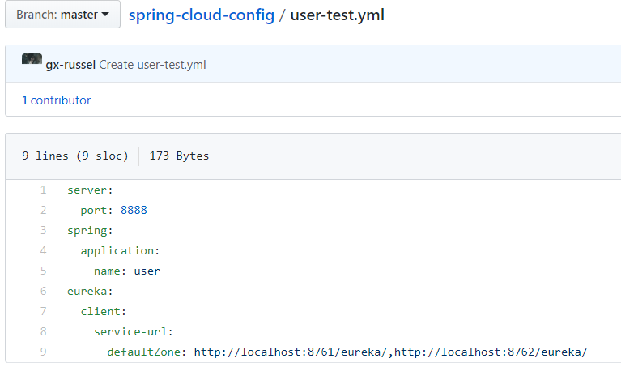


### 修改配置文件

```yaml
server:
  port: 7777
spring:
  application:
    name: config-server
  cloud:
    config:
      server:
        git:
          uri: https://github.com/gx-russel/spring-cloud-config #公开仓库的可以不写账号密码
          basedir: D:/IdeaProjects/config/basedir #本地存放路径 
eureka:
  client:
    service-url:
      defaultZone: http://localhost:8761/eureka

```


### 启动项目查看配置文件


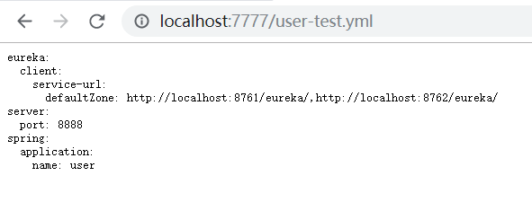

<http://localhost:7777/user-test.yml> 

有两种查看方式: 

1. /{name}-{profiles}.yml
2. /{lavel}/{name}-{profiles}.yml

- name:服务名
- profiles:环境
- label:分支(branch)


还可以获取properties和json格式的

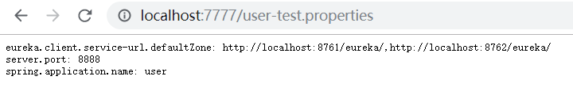

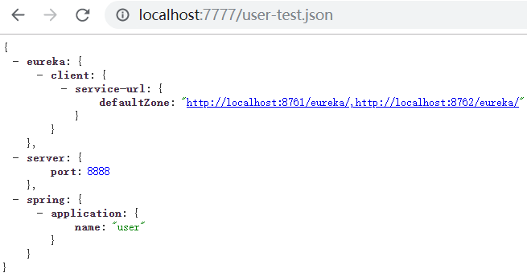

⚠注意:不管获取哪个环境的配置文件,都会把默认的配置文件拉到本地然后和其他环境的配置合并,一般把通用的配置放在默认的配置文件中 服务名.yml
在这默认的配置文件也就是user.yml

## 3. Config Client

在仓库添加user-dev.yml

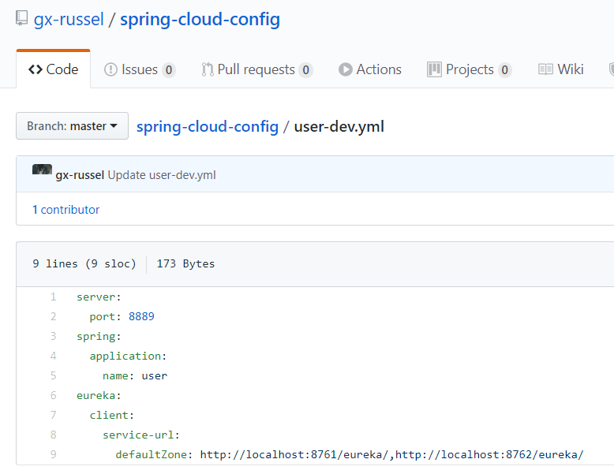


### 添加依赖

```java
<dependency>
            <groupId>org.springframework.cloud</groupId>
            <artifactId>spring-cloud-config-client</artifactId>
        </dependency>
```

### 添加注解

```java
@EnableDiscoveryClient
```


### 修改application.yml

把名字改成 bootstrap.yml 

⚠注意:
- bootstrap.yml优先级比application.yml高,如果项目有用到数据库又没有改成bootstrap.yml启动项目会报错,因为没获取到远端仓库的配置找不到数据库的配置
- 获取配置需要到注册中心获取配置中心的服务,所以要把获取服务中心的地址写到bootstrap.yml中如果写就是端口8761的默认地址,如果没有端口8761的注册中心就会报错找不到注册中心


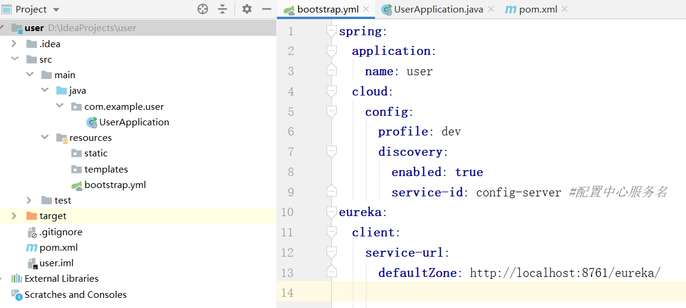

```yaml
spring:
  application:
    name: user #服务名
  cloud:
    config:
      profile: dev #环境
      discovery:
        enabled: true
        service-id: config-server #配置中心服务名
eureka:
  client:
    service-url:
      defaultZone: http://localhost:8761/eureka/

```

启动项目访问8889可以访问证明用的是配置中心的user-dev.yml配置文件

<http://localhost:8889/> 

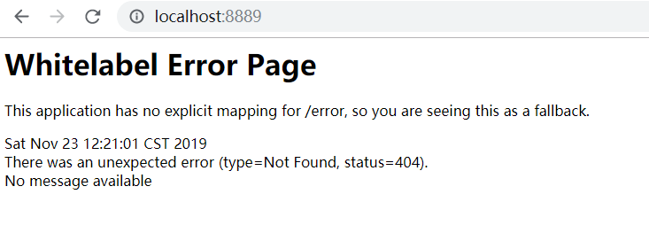


## 4.不重启刷新配置文件


使用spring-cloud-bus 的/bus-refresh 接口刷新配置


这里使用到了[RabbitMQ](<https://www.rabbitmq.com) 首先保证RabbitMQ服务已经启动


### config server添加依赖

```xml
<dependency>
    <groupId>org.springframework.cloud</groupId>
    <artifactId>spring-cloud-starter-bus-amqp</artifactId>
</dependency>
```

修改config server配置文件 添加下面这个配置 

```yml
management:
  endpoints:
    web:
      exposure:
        include: "*"
```

启动服务查看RabbitMQ 队列中多了个队列

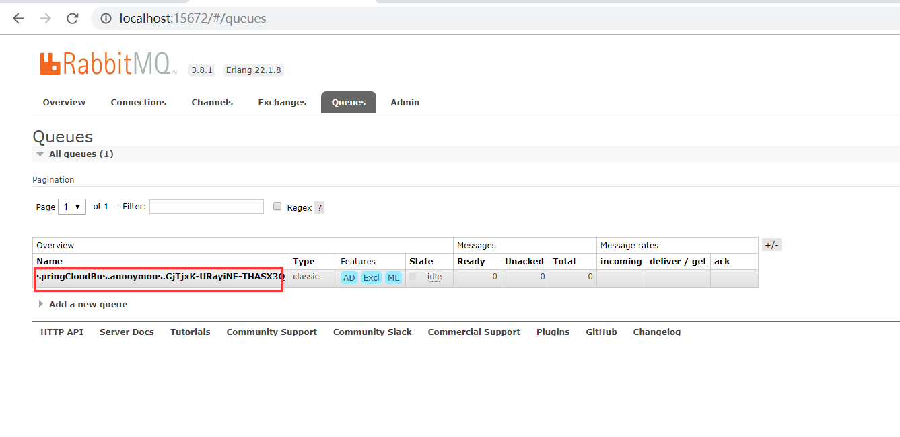


### user服务中 添加依赖

```xml
<dependency>
    <groupId>org.springframework.cloud</groupId>
    <artifactId>spring-cloud-starter-bus-amqp</artifactId>
</dependency>
```

启动服务

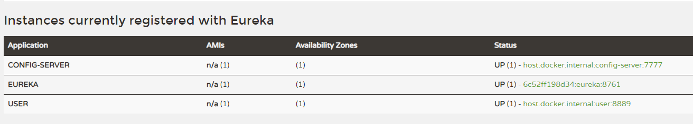

查看RabbitMQ也多了个队列

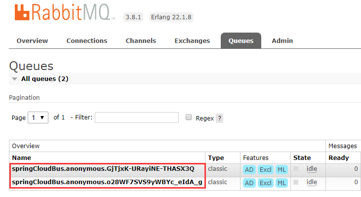


为了演示动态刷新配置文件我这里在GitHub上的user-test.yml user-dev.yml 配置了env作为区分

在user服务写一个查看环境的接口

```java
@RestController
@RequestMapping("/test")
@RefreshScope//在需要刷新的配置的地方  加这个注解
public class TestController {
    @Value("${env}")
    private String env;

    @GetMapping("/env")
    public String env() {
        return env;
    }
}
```

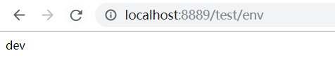

将GitHub上的dev改成 dev1

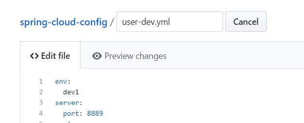


#### 手动发送刷新请求 

POST http://localhost:7777/actuator/bus-refresh

不需要重启服务 查看user环境就变成dev1了


#### 自动发送刷新

config server添加依赖

```xml
<dependency>
    <groupId>org.springframework.cloud</groupId>
    <artifactId>spring-cloud-config-monitor</artifactId>
</dependency>
```

config client配置文件bootstrap.yml 添加下面配置

```yaml
spring:
  cloud:
    bus:
      trace:
      	#开启监听
        enabled: true
      #代表该实例，在github刷新的时候要用到。  
      id: ${vcap.application.name:${spring.application.name:application}}:${vcap.application.instance_index:${spring.cloud.config.profile:${local.server.port:${server.port:0}}}}:${vcap.application.instance_id:${random.value}}
```

1.使用[natapp](https://natapp.cn/)内网穿透 让外网可以访问到本地的服务

2.需要在仓库的设置中添加 [Webhooks](https://developer.github.com/webhooks/)

- Webhooks的配置如下：

  1.Payload URL（在仓库更新时github会向你的配置中心发送一个请求，来刷新你配置中心的配置）
  2.Content type（参数类型）
  3.secret 用作给POST的body加密的字符串。采用HMAC算法
  4.选择只有在提交代码的时候才会触发

- 其中具体配置

  1.Payload URL：必须是可访问的域名！而且格式为http://域名/monitor?path=* 。在springboot2之前使用的是/bus/refresh。后来改成/actuator/bus-refresh，但是github他会附带一个payload参数，这玩意好像解析不了，会给你默认为String。然后就报错。所以要使用最新的接口/monitor，这时springCloud专门提供的。path是[官方文档](<https://cloud.spring.io/spring-cloud-static/spring-cloud-config/2.2.0.RC2/reference/html/#_push_notifications_and_spring_cloud_bus> )说你所要刷新到那个客户端，*表示所有的config-client
  2.Content type：application/json


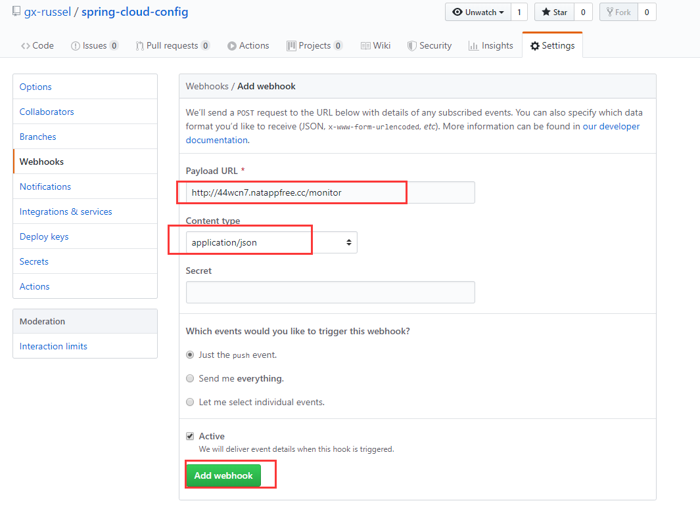


把dev1的环境改成dev2

 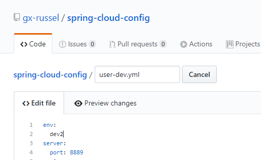


查看user环境

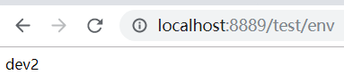

Perfect 😝:smile:

